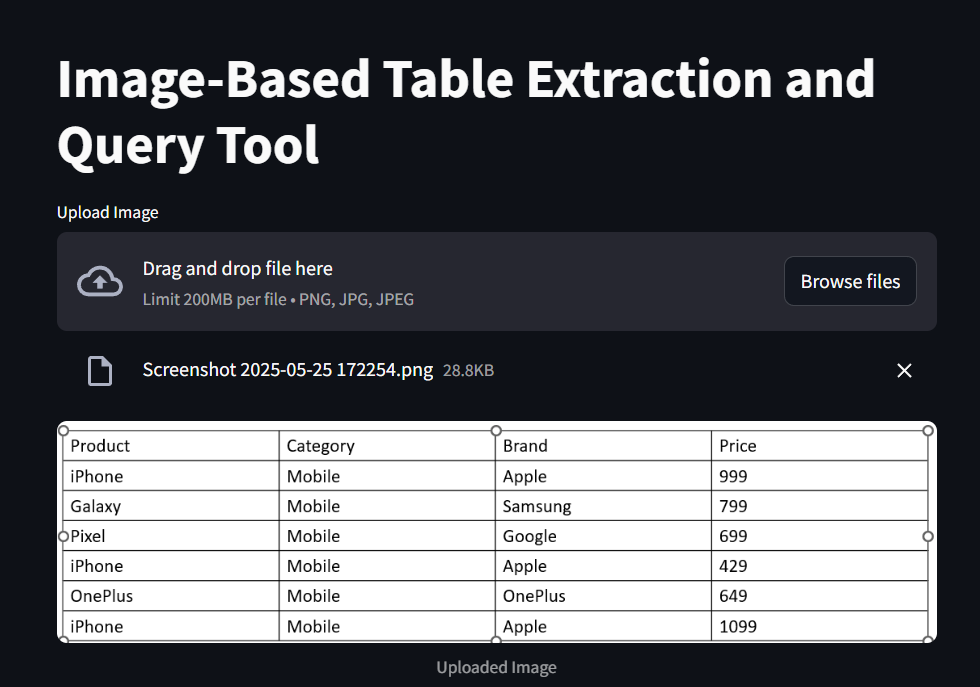
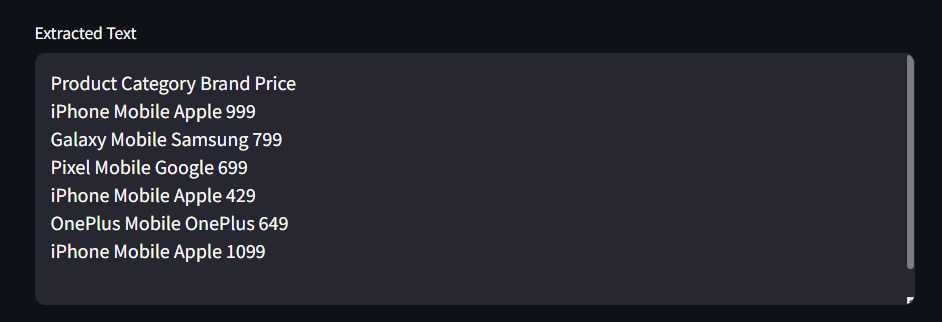
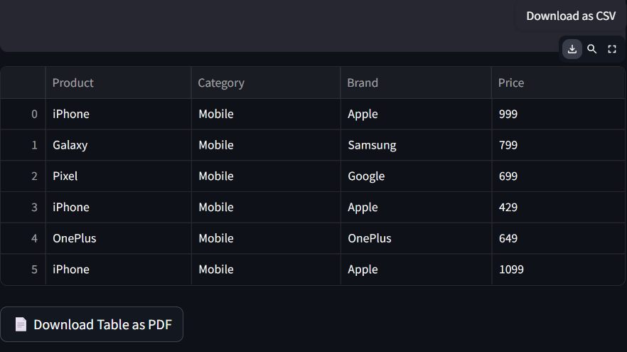
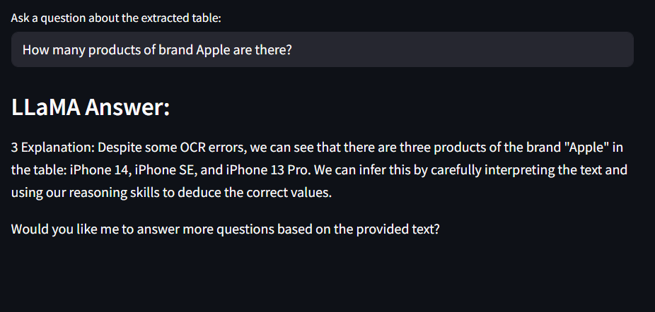

# Image-Based Table Extraction and Query Tool

This project provides an intelligent web-based interface to extract tables from images using OCR and answer natural language questions about the extracted table using a local LLaMA 2 language model.

---

# Llama 2
The Llama 2 release introduces a family of pretrained and fine-tuned LLMs, ranging in scale from 7B to 70B parameters (7B, 13B, 70B). The pretrained models come with significant improvements over the Llama 1 models, including being trained on 40% more tokens, having a much longer context length (4k tokens), and using grouped-query attention for fast inference of the 70B model!

---

## Features

- Upload an image with a table (PNG/JPG/JPEG)
- Extract table text using **Tesseract OCR**
- Parse and display the table as a **DataFrame**
- Download the table as a **PDF**
- Ask natural language questions about the extracted data using **LLaMA 2**
- Smart reasoning and explanations (limited math capability)

## Example Use Case

Upload the image

---

> 

---

Extract the text using OCR

---

> 

---

Convert into data frame(Download PDF file or csv file)

---

> 

---

Extracted text given as input to LLaMa 2

---

> 

---
